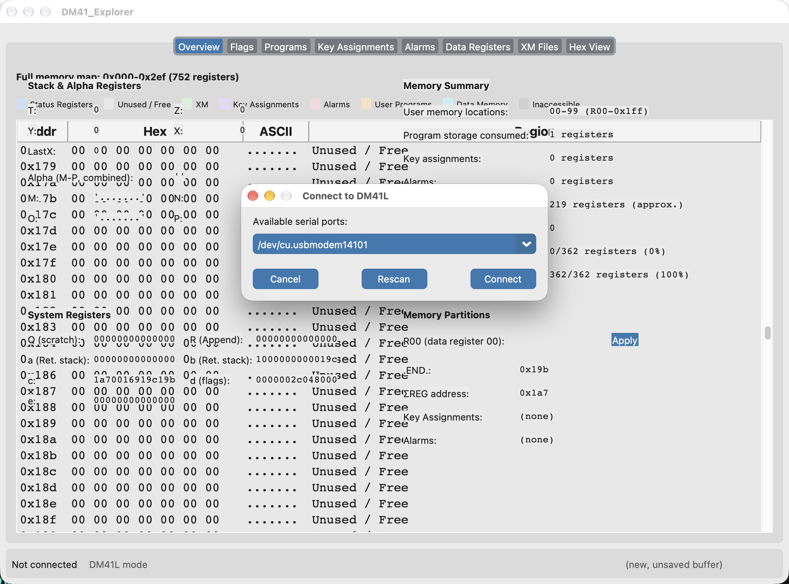
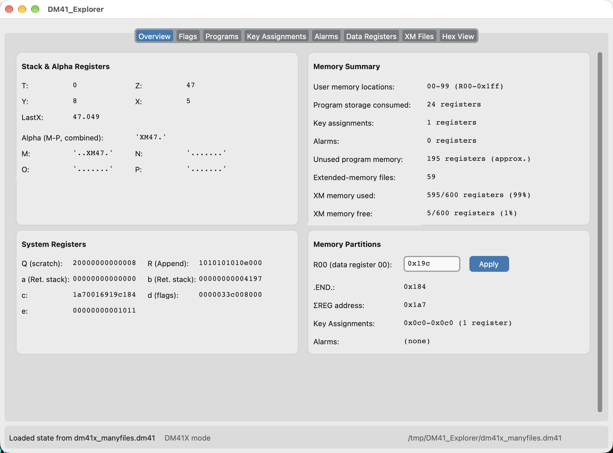
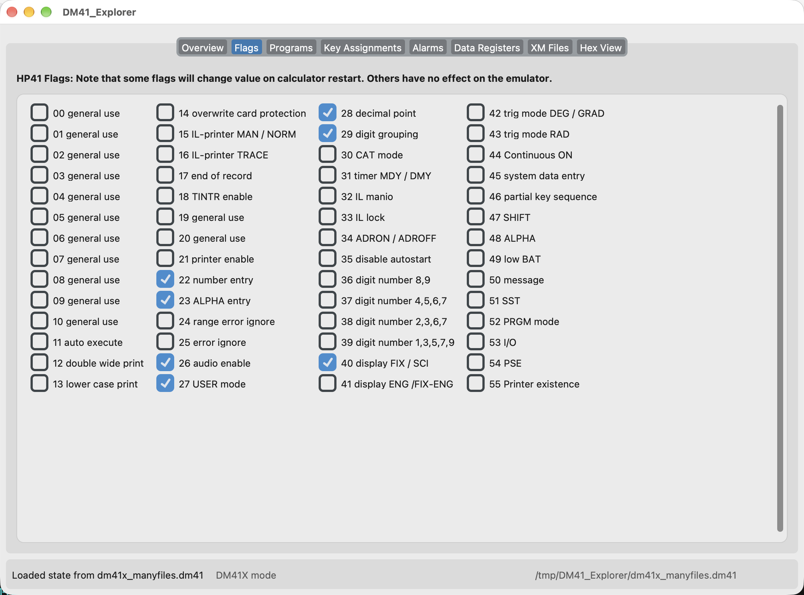
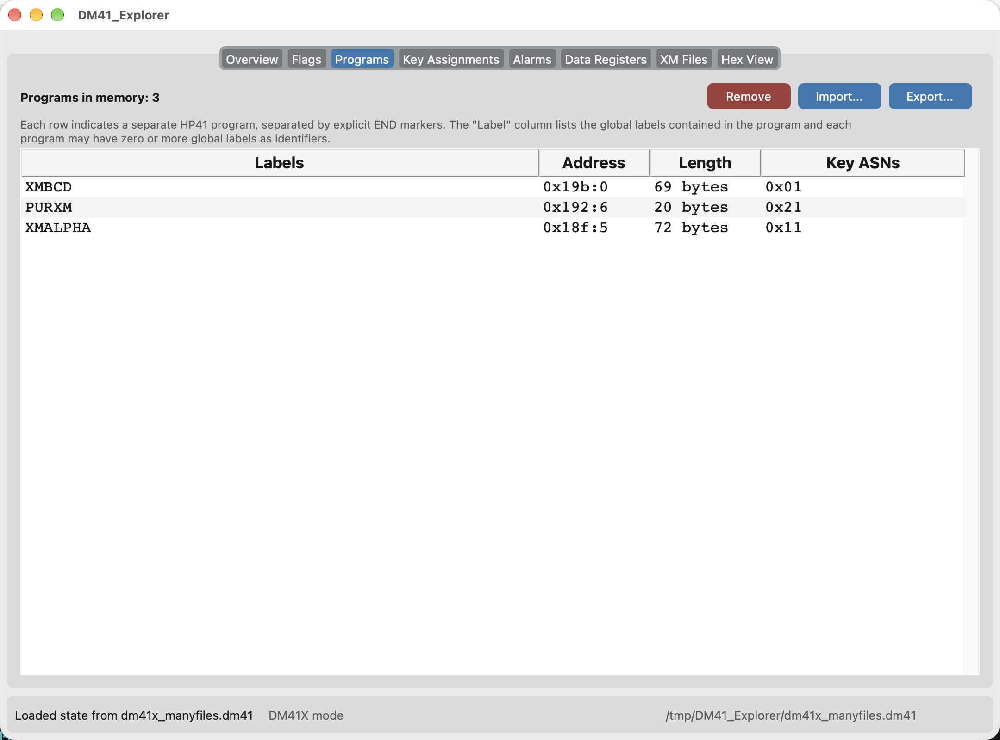
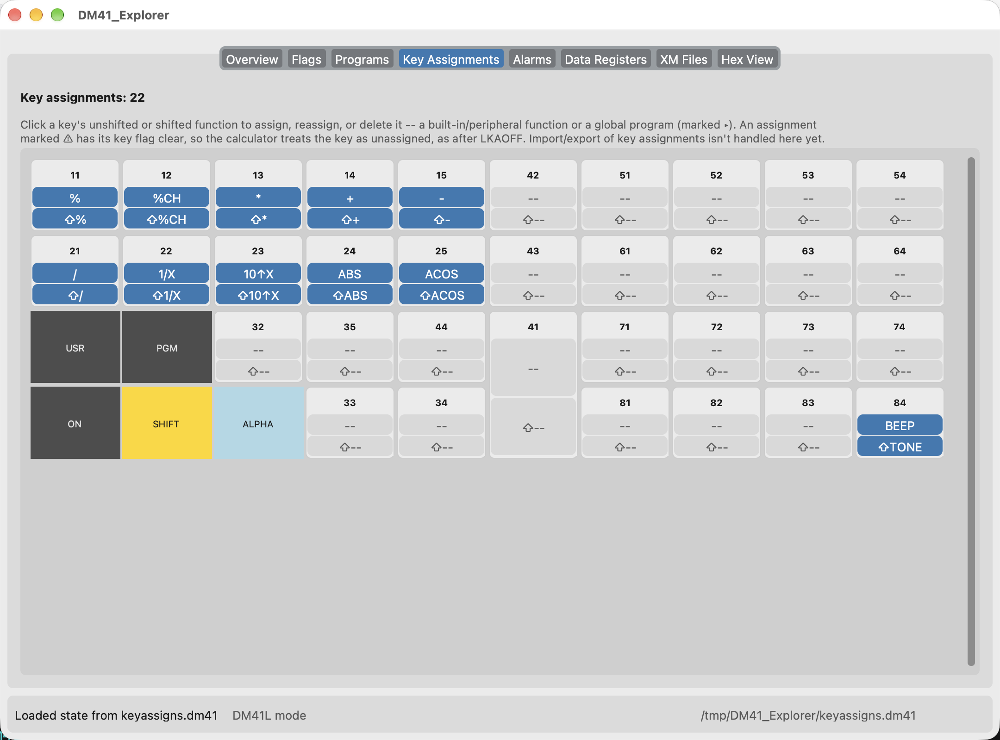
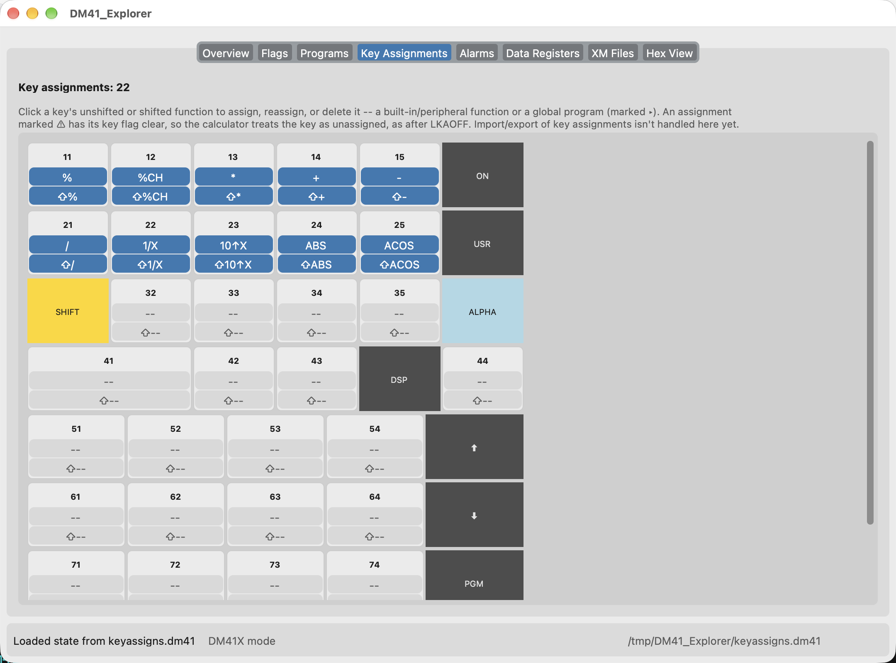
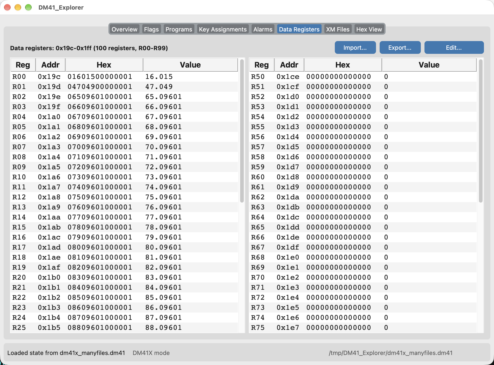
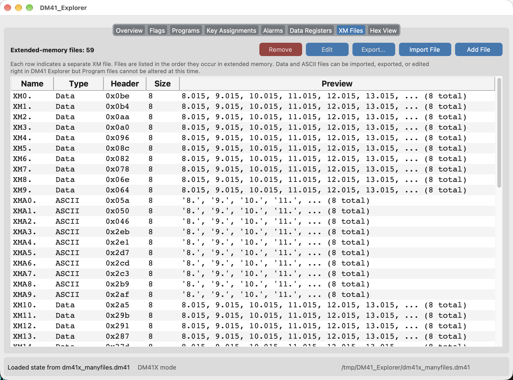
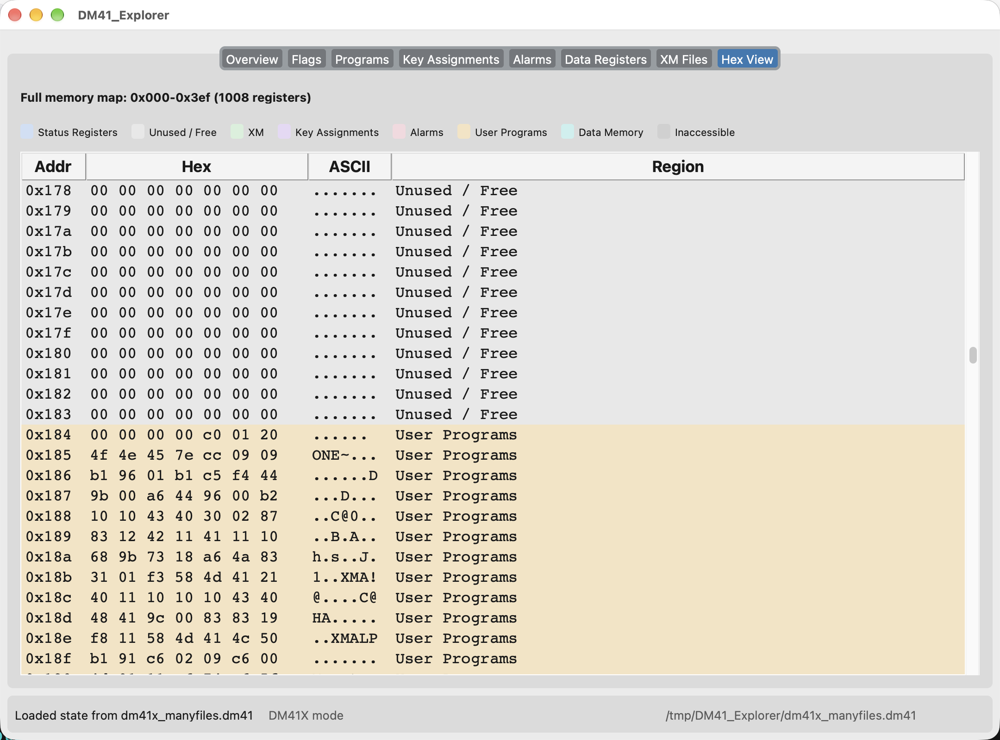

# DM41_Explorer

A Windows, MacOS, and Linux desktop GUI for reading, writing, and editing the
memory of a [DM41L/X](https://www.swissmicros.com/) (HP‑41CX emulator) over its
serial console or USB disk interface.

## Features

- **Overview** — A quick summary view of the contents of the DM41L/X's memory,
  including the stack & alpha registers, main memory, and extended memory. Also
  shows the current values of R00, .END., ΣREG, and a memory-usage summary at a
  glance.
- **Flags** — all 56 status flags, named and editable.
- **Programs** — list, import, export, and remove programs from the
  calculator's memory.
- **Data Registers** — browse and edit the user memory registers as numbers,
  text, or raw hex.
- **XM Files** — list, add, edit, and remove files stored in extended memory
  (Data, ASCII, and Program types).
- **Key Assignments** - view, add, edit, and remove user key assignments.
- Connect directly to a DM41L over USB serial, or work entirely offline from a
  saved `.dm41` state file (File > Open / Save State).
- **Hex View** — a full, color-coded map of the entire memory space (status
  registers, extended memory, program memory, data memory, and unused space).

## Requirements

- Python 3.10 or later (developed and tested with 3.12).
- A DM41L connected over USB, if you want to talk to real hardware —
  otherwise you only need a `.dm41` state file to explore.

## Using DM41_Explorer

DM41_Explorer supports two modes of operation: Serially connected (for the
DM41L) or disk-based (for the DM41X or for editing saved state files). 

## Connecting to a DM41L

A serial connection is necessary only for data transfer to or from the DM41L.
To configure the device for connectivity, power the calculator off and then
press and release the “ON” and “C” keys simultaneously to enable the serial
console. 

Once the calculator is set to SERIAL CONSOLE mode and a USB connection is
established with your computer, make sure DM41_Explorer is in **DM41L mode**
(Preferences → General → Calculator model; the status bar shows the current
one), then choose “Connect / Reconnect…” from the “Connect” menu (Ctrl+K or
Cmd+K on macOS). A dialog box resembling the
following will be displayed:



Choose the appropriate serial port and press the Connect button. Upon
connection, the calculator’s memory is retrieved—provided no state has been
previously loaded or modified—and displayed in the Overview tab.  

When connecting to the DM41L, DM41_Explorer loads the current memory contents
if no state has been opened or altered. To reload a state from the calculator
at a later time, use the Connect menu.

#### Which serial port do I use? 

If you are unsure which serial port to select, follow these steps to identify
the correct one:

1. Disconnect the calculator.
2. Click the "Rescan" button.
3. Note the available serial ports.
4. Reconnect the calculator.
5. Click "Rescan" again.
6. Identify the newly listed serial port.

Once a successful connection is established, DM41_Explorer will automatically
save and preselect this port for future sessions.


## Working in Disk-Based Mode

The DM41X uses a disk-based USB interface and supports the storage of multiple
state files. To generate a state file on the DM41X, press SETUP, select “File,”
and choose “Save DM41 state file.” This procedure must be completed before
DM41_Explorer can load the calculator’s state.  

Once a state file is stored on the device, connect the DM41X to your computer,
press CST, and select “USB Disk” from the calculator menu; the unit will appear
as a removable drive.  

To load a state file into DM41_Explorer, select “Load State” from the “File”
menu. To transfer a state file back to the calculator, use the “Save State”
command. Eject the disk from the computer when you are finished.

The DM41X can store multiple state files. To load a particular state file onto
the calculator, eject the device from the computer, press SETUP, select “File,”
and choose “Load DM41 State File.”  

Additionally, the “File” menu may be used to load and save state files from
other directories on your computer.

### Overview Tab



The Overview tab shows a quick summary of either the state of the currently
loaded memory state. It is almost entirely read-only, except for the address of
the R00 register, which you can adjust if you want to experiment with synthetic
programming.

### Flags Tab



A complete list of the all the user and system flags and their current values.
Some of the flags are available for use by HP41 applications, some control
system behavior, and others pertain to peripherals and will have no effect on
the DM41L. Some flags are automatically reset each time the calculator is
turned on.

### Programs Tab

 

The programs tab shows a list of the apps currently loaded into the program
memory portion of the loaded state file. From this view you can export and
remove loaded programs, and import new ones. Programs can be imported or
exported in RAW, TXT, or DAT format. DM41 Explorer also supports "PPC" format
which is the same as DAT format but with line breaks.

### Key Assignments Tab





The Key Assignments tab allows you to view and edit the user key assignments in
the loaded state. It has two sub-tabs: the first shows the keys in the DM41L
layout, and the second in the DM41X layout. Both show the same assignments, so
an edit made on either one appears on the other. Clicking on a key will let you
edit that key's current assignment - you can either select one of the built-in
HP41CX functions, or one of the currently loaded programs, or enter in two
hexadecimal bytes if you want to experiment with synthetic programming.

### Data Registers Tab



The Data Registers view shows the contents of user memory, and allows you to
import, export, and alter portions of it. It's broken into two halves (to make
better use of space) and you can enter BCD, ASCII, or hexadecimal data into any
register. Select a register with the mouse, then click on the desired action.

### XM Files Tab



The XM Files view is organized similarly to the Data Registers view, and allows
you to import, export, and alter files in Extended Memory. Unlike the Data
Registers view, XM Files does limit you to either BCD or ASCII data, and
Program files cannot be altered at this time.

### Hex View Tab



The Hex view shows the raw contents of calculator memory, color-coded by the
region. It is useful for studying how HP41 memory is organized.

## Keyboard Shortcuts

DM41_Explorer is menu-driven, and every shortcut below mirrors a menu item (or,
for Export/Import, a tab's header button). `Ctrl` is used on Windows and Linux;
macOS uses `Cmd` for the same shortcuts.

| Action | Windows / Linux | macOS |
| --- | --- | --- |
| New Memory Buffer | Ctrl+N | Cmd+N |
| Open State... | Ctrl+O | Cmd+O |
| Save State | Ctrl+S | Cmd+S |
| Preferences | Ctrl+, | Cmd+, |
| Quit | Ctrl+Q | Cmd+Q |
| Connect / Reconnect... | Ctrl+K | Cmd+K |
| Disconnect | Ctrl+D | Cmd+D |
| Set Calculator Time | Ctrl+T | Cmd+T |
| Get State from DM41L | Ctrl+G | Cmd+G |
| Send State to DM41L | Ctrl+U | Cmd+U |
| Refresh Tabs | F5 | F5 |
| Export... | Ctrl+E | Cmd+E |
| Import... | Ctrl+I | Cmd+I |

Export and Import act on whichever tab is currently active, and only take
effect on the Data Registers, XM Files, and Programs tabs — elsewhere they're
a no-op.

The five Connect-menu shortcuts (Connect / Reconnect, Disconnect, Set
Calculator Time, Get State, Send State) work in **DM41L mode** only. A DM41X
has no serial console, so in DM41X mode those menu items are greyed out and
the shortcuts say so rather than doing anything — see “Calculator model”
below.

## Calculator model

DM41_Explorer works as one model at a time, chosen in Preferences → General
→ Calculator model and shown in the status bar. New installations start in
**DM41X mode**, the more common device.

| | DM41L mode | DM41X mode |
| --- | --- | --- |
| Serial connection | Yes | No — a DM41X has no serial console |
| Extended memory | 362 registers | 600 registers |
| Functions | the HP-41CX set | that, plus the DM41X’s own |
| Key Assignments tab | the DM41L keyboard | the classic HP-41 keyboard |
| New files default to | `.dm41` | `.d41` |

Two things follow from this:

- **Changing the model starts a new, empty memory state.** To move programs
  or data from one model to the other, export them before switching and
  import them afterwards.
- **Opening a state that is too large for a DM41L**, while in DM41L mode,
  offers to switch to DM41X mode so it can be opened. Accepting applies for
  that session only and does not change the saved setting; the status bar
  then reads “DM41X mode (this session)”. Declining leaves everything as it
  was.

A state file itself says nothing about which model wrote it — a `.dm41` and a
`.d41` are the same format — so the mode, not the file, decides how one is
read.

## Documentation

There are many markdown files in the [`docs`](https://github.com/mwheinz/DM41_Explorer/tree/main/docs) directory. These represent my
research notes from developing this project. Hopefully they will be useful to
you if you are curious about the internals of the HP41 and the DM41L/X emulator.

Most of my notes are derived from 40 year old memories and classic HP41 texts
like *Synthetic Programming* by Jonathan Wickes, supplemented by
reverse-engineering DM41L memory states. Other sources include *A Programmer's
Handbook* by Poul Kaarup, *HP-41 Advanced Programming Tips* by Alan McCornack &
Keith Jarett, and *Synthetic Programming Made Easy* by Keith Jarett. Other
information came from conducting experiments and studying the resulting memory
states

## Running from source

```sh
git clone https://github.com/mwheinz/DM41_Explorer.git
cd DM41_Explorer
python3 -m venv venv
source venv/bin/activate   # on Windows: venv\Scripts\activate
pip install -r requirements.txt
cd src
python3 -m gui.app
```

On Linux, `tkinter` isn't always bundled with Python — if the app fails to
import `tkinter`, install it separately first (e.g. `sudo apt install
python3-tk` on Debian/Ubuntu).

To also run the test suite or build a standalone binary, install the
development requirements instead of just the runtime ones:

```sh
pip install -r requirements-dev.txt
```

## Building the standalone application

A PyInstaller spec (`src/dm41explorer.spec`) and build script (`src/build.sh`)
are included, producing a self-contained app — a macOS `.app` bundle
(with `.dm41` file association) on macOS, and a onedir bundle on Linux and
Windows.

```sh
cd src
./build.sh
```

Output lands in `src/dist/`. `build.sh` is a shell script — on Windows,
run it from Git Bash (installed alongside [Git for
Windows](https://git-scm.com/download/win)) or WSL, or invoke PyInstaller
directly with `pyinstaller dm41explorer.spec` after generating `dm41version.py`
yourself (see the comment at the top of `build.sh`).

On Linux and Windows, the executable needs the `_internal/` folder that's
built alongside it — don't separate them, or move the exe without also
moving `_internal/`. A `README.txt` explaining this ships in that same
output folder (and in every release download) for anyone unzipping it
without this context. The Linux build also includes `MyIcon.png`, ready
to use as a `.desktop` file's `Icon=` entry if you set one up yourself.

The built binaries aren't code-signed (this is an independently-developed
hobby project without an Apple or Microsoft developer account), so:

- **macOS** will refuse to open it as coming from an "unidentified
  developer" — right-click (or Control-click) the app and choose Open,
  then confirm once, instead of double-clicking it.
- **Windows** will show a SmartScreen warning — click "More info", then
  "Run anyway".

Building and running from source, as above, doesn't trigger either of
these.

## Contributing

Bug reports, feature requests, and pull requests are welcome — see
[`CONTRIBUTING.md`](CONTRIBUTING.md) for how to get set up, run the tests, and
what makes a good bug report or PR.

## Running the tests

```sh
pip install -r requirements-dev.txt
pytest
```

## License

Copyright (C) 2026 Michael Heinz.

DM41_Explorer is free software: you can redistribute it and/or modify it
under the terms of the GNU General Public License, version 3, as published by
the Free Software Foundation. It is distributed in the hope that it will be
useful, but WITHOUT ANY WARRANTY; without even the implied warranty of
MERCHANTABILITY or FITNESS FOR A PARTICULAR PURPOSE. See the GNU General
Public License for more details.

The full text is in [`LICENSE`](LICENSE), and is also at
<https://www.gnu.org/licenses/gpl-3.0.html>.
